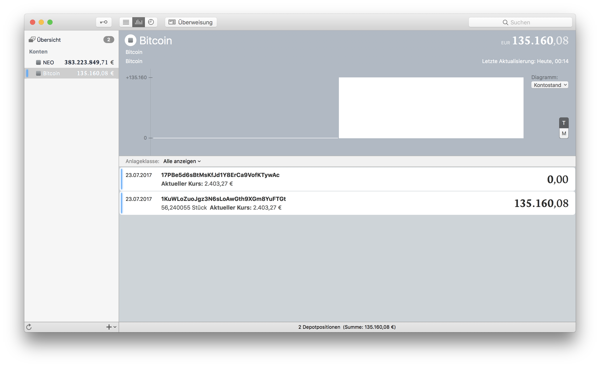

# Bitcoin-MoneyMoney
Fetches amount and value of privately held Bitcoin address via blockexplorer and returns it as a security.
This can be also be used to track your cold storage.

Originally developed by Dr. Johannes Jacubeit. (https://github.com/Jacubeit/Bitcoin-MoneyMoney)
As it was no longer actively maintained I took the liberty to fork it and maintain it further.

## Extension Setup

You can get a signed version of this extension from

* my [GitHub releases page](https://github.com/UdoBretz/Bitcoin-MoneyMoney/releases/tag/v0.3), or
* the [MoneyMoney Extensions](https://moneymoney-app.com/extensions/) page

Once downloaded, move `Bitcoin.lua` to your MoneyMoney Extensions folder.

**Note:** This extension requires MoneyMoney **Version 2.2.19** or newer.

## MoneyMoney Setup

Add a new account (type "Bitcoin").

**Use your Bitcoin adresses coma separated as user name**
`1KuWLoZuoJgz3N6sLoAwGth9XGm8YuFTGt, 1KuWLoZuoJgz3N6sLoAwGth9XGm8YuFTGt` (example)
